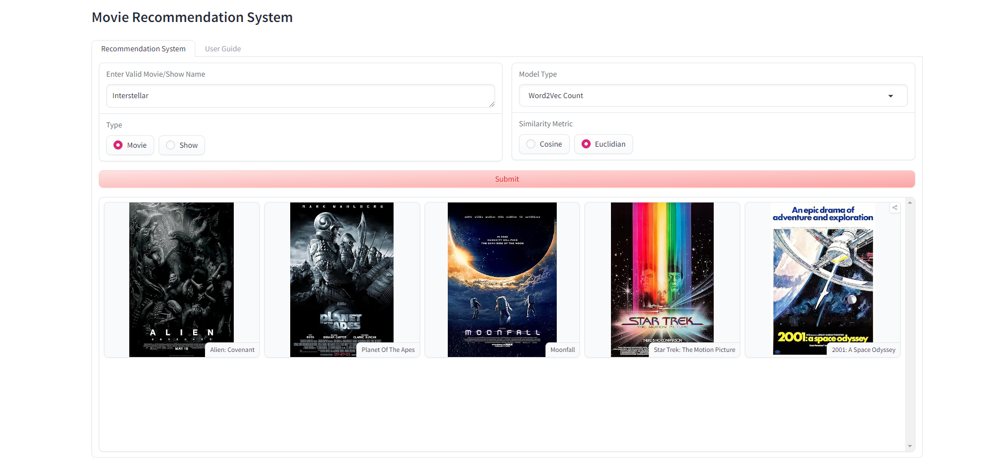
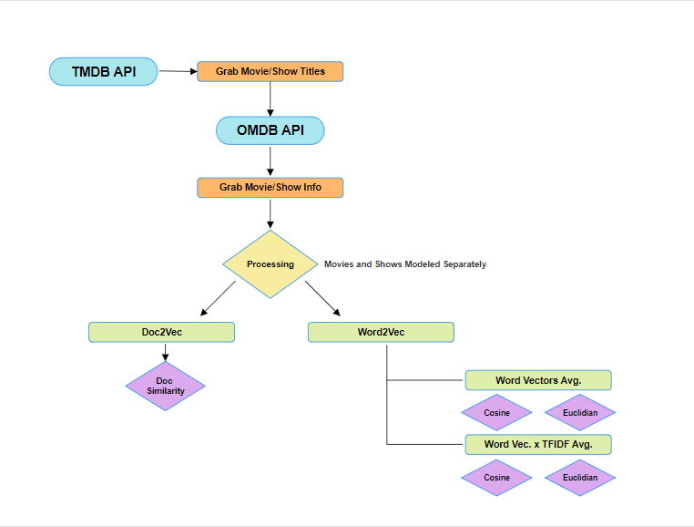
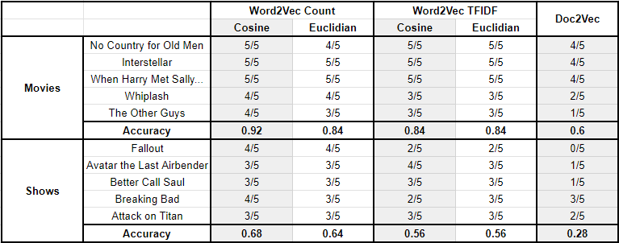

# Welcome to the Movie Recommendation System

See [Huggingface Spaces](https://huggingface.co/spaces/brandonowens/movie-recommendation-app) to run the app!

Simply enter a valid movie or show (with the correct type option selected), the model you wish to use to find similar movies or shows, and the method of similarity.
Then, click submit and in 1-5 seconds, the model will **return 5 movies or shows (with their respective posters) that are the most similar to your inputted movie or show!**

### Having Trouble?

* Make sure that if you are entering a movie, the `Movie` tab is selected (and the `Show` tab for shows).
    * It is possible that your movie/show doesn't exist in the database (last updated 4/22/2024).
    * Ex:
> "No Country for Old Men" is a movie and must have the `Movie` button selected under type.

* Make sure the title is formatted correctly:
    * Caps do not matter
    * Punctuation and numbers do
    * Ex:
> **Correct:** Star Wars: Episode III – Revenge of the Sith
> 
> **Correct:** star wars: episode III - revenge of the sith
> 
> **Incorrect:** Star Wars Episode 3 - Revenge of the sith
> 
### Model and Similarity Metric Understanding:

To create the application, data was scraped from [TMDB API](https://developer.themoviedb.org/reference/intro/getting-started) to obtain the names of movies and television shows.
With the desired names and ids, plot information was scraped from the [OMBD API](https://www.omdbapi.com/). This resulted in ~1.02 million movies and ~170k shows in my dataset.
I then processed the information in order to get a training corpus. This involved dropping missing columns such as "Title", "Plot", "Genre", "Type", and "Director", dropping "Title" duplicates,
filtering for origin country to be "United States" or "Japan" or the filtered original language being "English". 

I then created a column called "Description" that fused together the genre,
type, director, plot, and keywords for each movie/show. This left me with ~200k movies and ~20k shows. I then tokenized these descriptions, lowercasing and removing punctuation.
I tried a purely NLP approach -- no other features were encoded besides these descriptions. Because of the timeline on getting this project in, I didn't have the time to incorporate other features or test compared to
pre-trained word embeddings. This may have been slightly problematic because it creates a bias and dependency on how well the movie's "full" plot description captures the information of the movie. Perhaps some movies or shows
give less information to create mystery and interest and perhaps some writers are just bad at summarization tasks.

I then took these corpora and applied them separately to 3 different models with different similarity metrics:

* Models
    * Word2Vec Count: Trained movie/show corpus on Gensim's Word2Vec. In order to get the document embedding, the word vectors for the description are averaged.
    * Word2Vec TFIDF: Trained movie/show corpus on Gensim's Word2Vec. In order to get the document embedding, the word vectors are multiplied by a TFIDF vectorizer and then averaged.
    * Doc2Vec: Trained movie/show corpus on Gensim's Doc2Vec.
      
* Similarity Metric
    * Cosine: Utilizes cosine similarity to retrieve the top 5 most similar movies/shows.
    * Euclidian: Utilizes the distance formula to find the smallest distance between movie/show embeddings to retrieve the top 5 most similar movies/shows.
      
I saved the Doc2Vec models and the different document embeddings for the separate word2vec models as numpy matrices for faster processing in my Gradio app. These were all imported to Huggingface spaces
where I then built my Gradio app seen here. 

### Evaluation

Which model works the best? It depends.

Because this is a recommendation system and I don't have access to any sort of user data, I think the easiest, quick, and dirty way to see which metrics perform the best is to run the tool with my own preferences.
I wanted to query my app with 5 movies I like and 5 shows I also enjoy (about different genres). I then recorded the total of the 5 recommendations that I have watched, sounded interesting and related, or models relevant plot similarity to my inputted movie/show.

I ended up choosing... 

* No Country for Old Men (Western, Thriller)
* Interstellar (Sci-Fi)
* When Harry Met Sally... (Romance)
* Whiplash (Drama, Music)
* The Other Guys (Comedy)
* Fallout (Post-Apocalyptic, Adventure)
* Avatar the Last Airbender (Animated)
* Better Call Saul (Drama, Crime)
* Breaking Bad (Drama, Crime)
* Attack on Titan (Animated, War, Action)
* 
Although this isn't the largest cluster of data to sample from, the results looked like this...

Modeling that the Word2Vec Count model with cosine similarity had the best accuracy for both the movies and shows provided. While this may be subject to change with more data added,
especially because the Euclidian metric and the Word2Vec TFIDF models were pretty close, it becomes pretty apparent that the Doc2Vec model underperforms in both areas. Thus, it would be advised to use one of the Word2Vec 
models when trying to find similar entertainment mediums (which is ironic because it took by far the most time to train). Additionally, the accuracy from movies to shows is a bit alarming. It seems as though the shows really struggled to show some interesting similar shows compared to the movies.
This is most likely because there were only ~20,000 show descriptions to use for modeling as opposed to roughly 10x that many for movies. 

### Contributions:

* The idea of using a TFIDF approach instead of just comparing to pre-trained embeddings was found from [Dhilip Subramanian's Book Recommendation System](https://www.kdnuggets.com/2020/08/content-based-recommendation-system-word-embeddings.html).
* All models were built using Gensim.
  
### Limitations:

* Show Models:
  * With any future production, it would be useful to instead combine the shows and movies when training and add one-hot encoding for other features, like if it is a series or a movie.
* Lack of Comparison:
  * Should be compared to pre-trained models like GloVe or Google open word embeddings would be useful to see if training a Word2Vec or Doc2Vec model was more accurate than one that was trained by a big company with a much larger amount of data and more time.
* Focus on improving compute time
* Didn't add features to add additional filtering (language, country, minimum rating, etc.)

### Additional Information:

* All models were trained on an NVIDIA RTX 2070 GPU. 
* Check out the configuration reference at https://huggingface.co/docs/hub/spaces-config-reference

### Files
